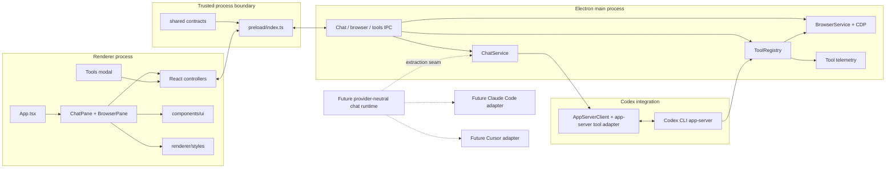
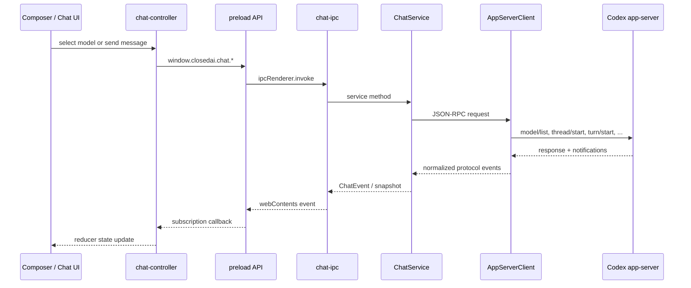
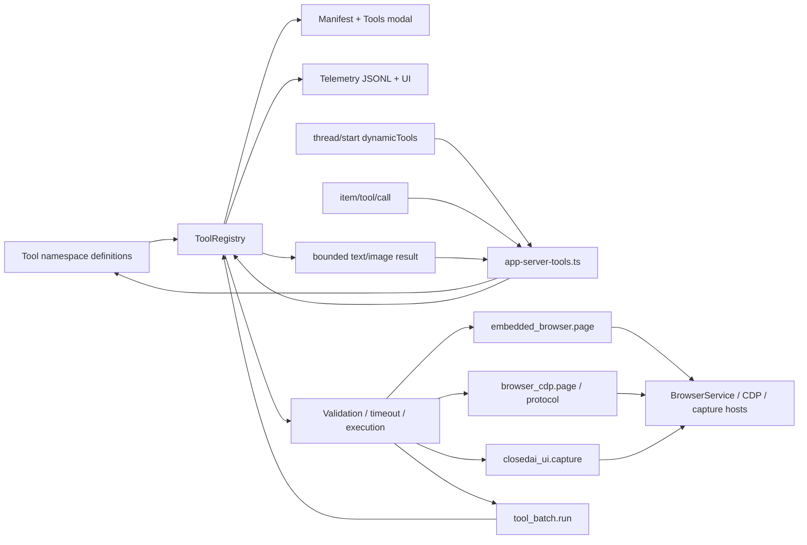

# ClosedAI codebase map

> Living navigation guide. Update this document when a responsibility moves, an entry point changes, or the active product focus shifts. It intentionally maps ownership and data flow rather than listing every file.

**Last verified:** 2026-09-02  
**Current focus:** application UI, Codex models, and model tools  
**Later:** Claude Code and Cursor integrations (planned boundaries only; not implemented)

## Start here

| When the task is about... | Start at | Follow into |
| --- | --- | --- |
| App composition or split layout | `src/renderer/App.tsx` | `workspace-split.tsx`, `chat-pane.tsx`, `browser-pane.tsx` |
| Chat UI | `src/renderer/chat-pane.tsx` | `chat-controller.ts`, `composer.tsx`, `chat-transcript.tsx`, `chat-header.tsx` |
| Models or model selection | `src/main/chat-model-catalog.ts` | `chat-service.ts`, `shared/chat.ts`, `renderer/composer.tsx` |
| Sending a Codex turn | `src/main/chat-service.ts` | `chat-input.ts`, `chat-context/turn-context.ts`, `chat-context/thread-params.ts` |
| Codex process/protocol | `src/main/app-server-client.ts` | `chat-service.ts`, `chat-notification-router.ts`, `tools/app-server-tools.ts` |
| Adding or changing a model tool | `src/main/tools/` | namespace `index.ts`, `registry.ts`, the relevant host adapter, tests |
| Tools modal and switches | `src/renderer/tools/` | `shared/tools.ts`, `main/tools/ipc.ts`, `main/tools/manifest.ts` |
| Browser UI | `src/renderer/browser-pane.tsx` | `browser-controller.ts`, `main/browser-service.ts` |
| IPC/API shape | `src/shared/api.ts` | `preload/index.ts`, then the matching main-process IPC module |
| Reusable visual primitive | `src/components/ui/` | feature consumer in `src/renderer/` |
| Styling | `src/renderer/styles.css` | focused module under `src/renderer/styles/` |

## System map

Solid arrows are implemented today. Dashed nodes describe likely future adapter boundaries, not existing code.



## UI map

```text
src/renderer/App.tsx                         renderer boot + top-level shell
├── app-window-controls.tsx                  frameless window controls
└── workspace-split.tsx                      resizable chat/browser composition
    ├── chat-pane.tsx                        chat feature orchestrator
    │   ├── chat-header.tsx                  title, history, tools entry
    │   ├── chat-history.tsx                 thread list and actions
    │   ├── chat-transcript.tsx              messages, reasoning, tools, screenshots
    │   ├── composer.tsx                     prompt, attachments, model picker
    │   ├── chat-controller.ts               preload calls + event subscription
    │   └── chat-state.ts                    pure renderer state transitions
    └── browser-pane.tsx                     browser chrome and page overlays
        ├── browser-controller.ts            browser state + navigation actions
        ├── browser-downloads-*               download UI/controller/model
        └── browser-navigation-error.tsx      navigation failure surface

src/components/ui/                           reusable, backend-agnostic primitives
src/components/ai-elements/                  AI-specific presentation pieces
src/components/prompt-kit/                   prompt presentation pieces
src/renderer/styles.css                      import-only style root
src/renderer/styles/                         feature-scoped style modules
```

### UI ownership rules

- Put view orchestration and application state in `src/renderer/`.
- Put reusable presentation primitives in `src/components/ui/`; they must not call `window.closedai`.
- Put cross-process types in `src/shared/`, never in a renderer component.
- Use `src/renderer/styles.css` as the import index and edit the focused feature stylesheet.
- Extract a feature directory when a concern grows to three or more files.

## Codex models and chat flow



### Codex ownership

| Concern | Owner |
| --- | --- |
| Spawn Codex and transport newline-delimited JSON-RPC | `src/main/app-server-client.ts` |
| Chat lifecycle and orchestration | `src/main/chat-service.ts` |
| Fetch models and choose the preferred/default model | `src/main/chat-model-catalog.ts` |
| Normalize app-server payloads | `src/main/chat-normalizers.ts` |
| Build message input and attachments | `src/main/chat-input.ts`, `chat-attachment-images.ts` |
| Thread start/resume configuration | `src/main/chat-context/thread-params.ts` |
| Per-turn app/browser context | `src/main/chat-context/turn-context.ts` |
| Context-window compaction | `src/main/chat-context/context-compaction.ts` |
| Thread continuation digest | `src/main/chat-context/thread-handoff.ts` |
| Turn notifications to transcript events | `src/main/chat-notification-router.ts`, `chat-transcript.ts` |
| Cross-process chat contract | `src/shared/chat.ts`, `src/shared/api.ts` |

### Model-selection path

1. `ChatService` connects through `AppServerClient`.
2. `loadChatModels()` requests every visible model with `model/list`.
3. The stored `chatModelId` wins when still available; otherwise the advertised default or first model wins.
4. `ChatSnapshot.models` and `selectedModel` cross IPC to the renderer.
5. The composer selects through `chat:selectModel`; the setting is persisted by `AppSettingsStore`.
6. The selected model is sent on a new `thread/start` and on `turn/start`.

## Model tools map

The core under `src/main/tools/` is provider-agnostic. Codex-specific translation is isolated in `app-server-tools.ts`.



### Tool layers

| Layer | Files | Responsibility |
| --- | --- | --- |
| Contracts | `src/main/tools/tool.ts`, `schema.ts` | Tool, namespace, input, output, action, timeout types |
| Registry | `src/main/tools/registry.ts` | Validation, enablement, dispatch, timeouts, result bounds, call records |
| Namespaces | `tools/browser/`, `tools/cdp/`, `tools/capture/`, `tools/batch/` | Model-visible capabilities |
| Codex adapter | `src/main/tools/app-server-tools.ts` | Advertise `dynamicTools`; answer `item/tool/call` |
| Host access | namespace `host.ts` files | Narrow bridge to browser/CDP/capture services |
| Settings and telemetry | `manifest.ts`, `telemetry.ts`, `ipc.ts` | Switches, persistence, statistics, renderer access |
| Renderer | `src/renderer/tools/` | Modal, detail, cards, controller |
| Shared UI contract | `src/shared/tools.ts` | Manifest, events, telemetry record shapes |

### Add a tool without creating a second execution path

1. Extend the matching namespace directory; create a namespace only when domain or trust differs.
2. Define the smallest host interface needed by the tool.
3. Export the namespace through its `index.ts` and register it in `src/main/index.ts`.
4. Add focused tests beside the implementation.
5. Let `ToolRegistry` continue to own validation, enablement, timeout, telemetry, and bounded output.
6. Use `app-server-tools.ts` only for Codex protocol translation.

## Process and contract boundaries

```text
renderer code
    │ only window.closedai
    ▼
src/shared/api.ts  ◄── type source for the public bridge
    │
src/preload/index.ts
    │ named IPC channels
    ▼
main-process IPC modules
    │
application services / tool hosts / stores
```

Never import Electron main-process modules into the renderer. A new renderer capability normally requires this order:

1. Add or extend a dependency-free contract in `src/shared/`.
2. Expose exactly that capability from `src/preload/index.ts`.
3. Register the matching handler in a focused `src/main/*-ipc.ts` module.
4. Call it from a renderer controller, keeping it out of presentation primitives.

## Future provider boundary

Claude Code and Cursor are roadmap integrations, not current modules. Before adding either, extract shared orchestration only where the second provider proves it is shared.

Keep these concerns separate:

| Provider-neutral candidate | Codex-specific today |
| --- | --- |
| Renderer chat state and transcript presentation | App-server JSON-RPC methods and notification names |
| Shared message/model/tool display types | Codex account login and model catalog payloads |
| Tool registry and tool definitions | `dynamicTools` advertisement and `item/tool/call` response |
| IPC-facing service interface | Codex process startup and thread semantics |

The likely adapter seam is between `ChatService` orchestration and `AppServerClient`. Do not rename current Codex concepts to generic concepts until another provider supplies a concrete interface to validate the abstraction.

## Fast maintenance routine

Update the top **Current focus** line whenever work moves. Update the rest only when architecture changes:

- A responsibility moved: change the relevant ownership table and text tree.
- A new UI feature appeared: add its orchestrator only, not every leaf file.
- A new tool namespace appeared: add one node/table row and its host boundary.
- A new provider appeared: replace its dashed future node with the implemented adapter path.
- An IPC surface changed: update the process-boundary section.
- A major flow changed: update the relevant Mermaid diagram.

Before treating the map as verified, run:

```bash
npm run check
```

The repository completion gate covers hygiene, types, tests, production build, and import closure.

